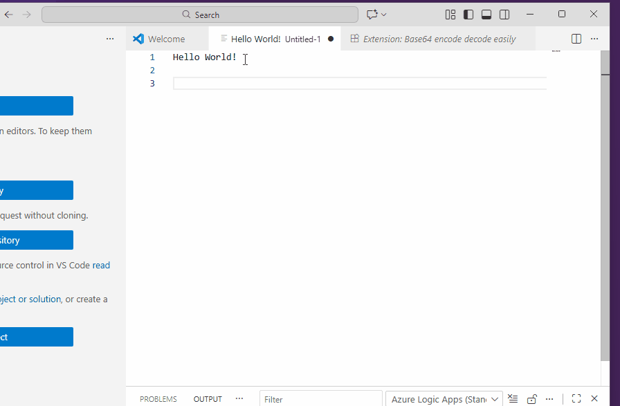

# base64-encode-decode-easily README
This is a reliable extension created to encode text to base-64 or decode base-64 text.

## Features
Base 64 Encode. Select text in the editor, right click and encode. Key board short cut: Ctrl + Shift + e
Base 64 Decode. Select text in the editor, right click decode. Key board short cut: Ctrl + Shift + d

